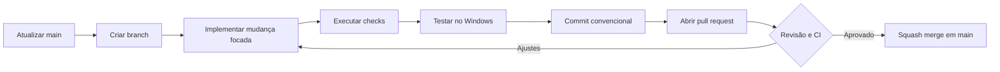
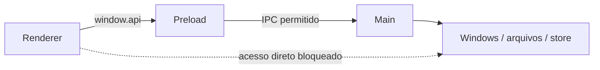
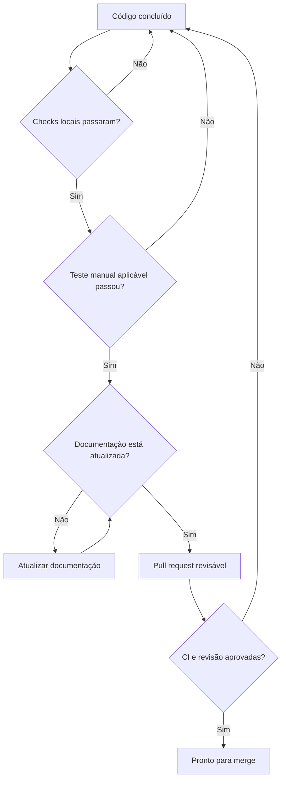

# Contribuindo com o MacroKey

Obrigado por ajudar a evoluir o MacroKey. Este documento descreve o caminho esperado entre uma ideia e uma alteração integrada à branch `main`.

> [!NOTE]
> O repositório é público e aceita issues e pull requests. O código é disponibilizado sob a [PolyForm Noncommercial License 1.0.0](LICENSE); usos comerciais exigem uma licença separada do autor.

## Navegação rápida

- [Antes de começar](#antes-de-começar)
- [Fluxo de trabalho](#fluxo-de-trabalho)
- [Organização do código](#organização-do-código)
- [Padrões de implementação](#padrões-de-implementação)
- [Validação](#validação)
- [Commits](#commits)
- [Pull requests](#pull-requests)
- [Licença das contribuições](#licença-das-contribuições)
- [Definição de pronto](#definição-de-pronto)

## Antes de começar

### Requisitos

- Windows 10 ou 11, x64;
- Node.js 22.12 ou mais recente;
- npm 10 ou mais recente;
- Git configurado com seu nome e e-mail;
- uma conta no GitHub para abrir issues ou enviar pull requests.

### Preparação do ambiente

```powershell
git clone https://github.com/Eduardo00073/MarkKey.git
cd MarkKey
npm install
npm run check
npm run dev
```

Se você não tiver permissão de escrita, faça um fork no GitHub e clone o seu fork antes de criar a branch de trabalho.

Se a validação inicial falhar antes de qualquer alteração, registre o resultado e resolva o estado de base antes de iniciar uma nova funcionalidade.

## Fluxo de trabalho



### 1. Atualize a base

```powershell
git switch main
git pull --ff-only
```

### 2. Crie uma branch curta

| Tipo | Padrão | Exemplo |
| --- | --- | --- |
| Funcionalidade | `feat/<assunto>` | `feat/pesquisa-de-macros` |
| Correção | `fix/<assunto>` | `fix/atalho-com-shift` |
| Refatoração | `refactor/<assunto>` | `refactor/contratos-ipc` |
| Documentação | `docs/<assunto>` | `docs/arquitetura` |
| Manutenção | `chore/<assunto>` | `chore/atualiza-dependencias` |

```powershell
git switch -c feat/minha-mudanca
```

### 3. Mantenha o escopo pequeno

Uma branch deve responder a uma pergunta clara. Não misture redesign, atualização de dependências e correção do engine no mesmo pull request.

## Organização do código

Antes de mover uma responsabilidade, consulte [docs/ARCHITECTURE.md](docs/ARCHITECTURE.md).

| Área | Responsabilidade | Não deve fazer |
| --- | --- | --- |
| `src/main/` | Electron, Windows API, arquivos, persistência, engine e IPC. | Renderizar a interface React. |
| `src/preload/` | Expor uma API mínima e tipada pelo `contextBridge`. | Entregar acesso genérico ao Node.js. |
| `src/renderer/` | Interface, estado visual, componentes e temas. | Importar módulos nativos ou acessar o sistema diretamente. |
| `src/shared/` | Tipos e constantes usados por mais de um processo. | Concentrar regras de negócio específicas de um processo. |



## Padrões de implementação

### TypeScript e contratos

- Não use `any` sem uma justificativa concreta e localizada.
- Valide dados recebidos de arquivos, IPC ou outras fronteiras externas.
- Mantenha os nomes de canais IPC em `src/shared/types.ts`.
- Exponha pelo preload somente as operações necessárias para a interface.
- Preserve os tipos de entrada separados dos campos gerados em runtime.

### Electron e segurança

- Preserve `contextIsolation: true` e `nodeIntegration: false`.
- Não exponha `ipcRenderer`, `fs`, `child_process` ou APIs equivalentes diretamente ao renderer.
- Não registre atalhos, startup ou hooks nativos na versão portátil quando o caminho for temporário.
- Libere hooks, timers, janelas auxiliares e ícones de bandeja no encerramento.
- Alterações em importação `.macrokey` devem tratar o arquivo como entrada não confiável.

### Interface e experiência

- Teste os temas claro e escuro.
- Use os ícones vetoriais existentes do Lucide para ações da interface.
- Inclua `title` ou `aria-label` em botões representados somente por ícones.
- Garanta foco visível e operação por teclado em controles interativos.
- Evite texto codificado em imagens.
- Não torne o HUD obrigatório: execução discreta é uma preferência do usuário.

### Dependências

Antes de adicionar um pacote, verifique:

1. se a plataforma ou uma dependência existente já resolve o problema;
2. se o pacote é mantido e compatível com a versão atual do Electron;
3. o impacto no tamanho do executável;
4. licenças e vulnerabilidades conhecidas;
5. se a dependência precisa executar scripts de instalação.

## Validação

### Portão mínimo obrigatório

```powershell
npm run check
npm run build
```

| Verificação | Cobertura |
| --- | --- |
| TypeScript | Processos main, preload e renderer. |
| Knip | Arquivos, exports e dependências sem uso. |
| Knip cycles | Dependências circulares. |
| npm audit | Vulnerabilidades conhecidas nas dependências. |
| Build | Compilação real dos três contextos do Electron. |

### Testes manuais por tipo de alteração

| Alteração | Validação adicional |
| --- | --- |
| Interface | Temas claro/escuro, teclado, resoluções mínimas e estados vazios. |
| Engine | Intercept, Auto-Type, Burst, cancelamento com `Escape` e combinações de modificadores. |
| Persistência | Fechar, reabrir e confirmar macros/preferências salvas. |
| Startup | Instalar, reiniciar sessão e confirmar abertura na bandeja. |
| HUD | Ativar/desativar, executar macro e confirmar que não rouba foco. |
| Importação | Arquivo válido, JSON inválido, versão futura e campos ausentes. |
| Empacotamento | Abrir o portátil e concluir instalação/desinstalação do Setup. |

## Commits

Use mensagens no formato [Conventional Commits](https://www.conventionalcommits.org/):

```text
tipo(escopo opcional): descrição curta no imperativo
```

| Tipo | Uso | Exemplo |
| --- | --- | --- |
| `feat` | Nova capacidade para o usuário. | `feat: adiciona pesquisa de macros` |
| `fix` | Correção de comportamento. | `fix: preserva modificadores no hotkey` |
| `refactor` | Mudança interna sem alterar comportamento. | `refactor: centraliza preferências do aplicativo` |
| `docs` | Documentação. | `docs: detalha fluxo de segurança` |
| `test` | Testes. | `test: cobre parser de variáveis` |
| `build` | Empacotamento ou dependências de build. | `build: configura artefato arm64` |
| `ci` | Automação do GitHub Actions. | `ci: valida pacote no Windows` |
| `chore` | Manutenção sem impacto direto no produto. | `chore: atualiza dependências` |

Evite mensagens genéricas como `ajustes`, `update` ou `corrige coisas`.

## Pull requests

O pull request deve permitir que outra pessoa entenda a mudança sem abrir todos os arquivos.

Inclua:

- o problema ou objetivo;
- a solução escolhida e decisões relevantes;
- como a mudança foi validada;
- imagens antes/depois para alterações visuais;
- riscos, limitações ou trabalho futuro;
- referência à issue, quando existir.

### Checklist do autor

- [ ] A branch contém uma única mudança coerente.
- [ ] Não há `node_modules/`, `out/`, `dist/`, logs ou dados pessoais no commit.
- [ ] Não há tokens, senhas, chaves ou outros segredos.
- [ ] `npm run check` passou.
- [ ] `npm run build` passou.
- [ ] O comportamento foi testado no Windows quando aplicável.
- [ ] Os dois temas foram conferidos quando a interface mudou.
- [ ] A documentação acompanha mudanças de comportamento ou arquitetura.
- [ ] O PR explica riscos e limitações conhecidos.

## Licença das contribuições

Ao enviar código, documentação ou outro material para este repositório, você declara que possui o direito de fazê-lo e concede a **Eduardo Junior Alcântara da Silva** uma licença não exclusiva, mundial, perpétua, irrevogável, sublicenciável e livre de royalties para usar, reproduzir, modificar, distribuir e relicenciar comercialmente a contribuição.

Você continua titular dos direitos autorais sobre o material que criou. Essa concessão permite que o mantenedor preserve o modelo de uso não comercial para a comunidade e, ao mesmo tempo, ofereça licenças comerciais separadas. Se você não puder conceder esses direitos, não envie a contribuição.

## Definição de pronto



Uma alteração só está pronta quando o código, a validação e a documentação contam a mesma história.

## Segurança

Não abra uma issue pública ou um pull request com detalhes exploráveis de uma vulnerabilidade. Interrompa o fluxo normal e siga [SECURITY.md](SECURITY.md).
