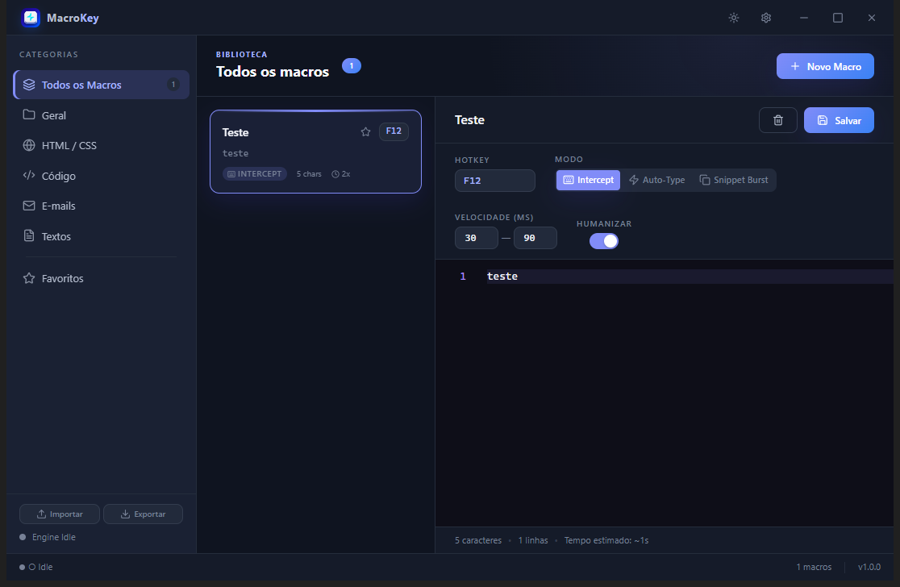
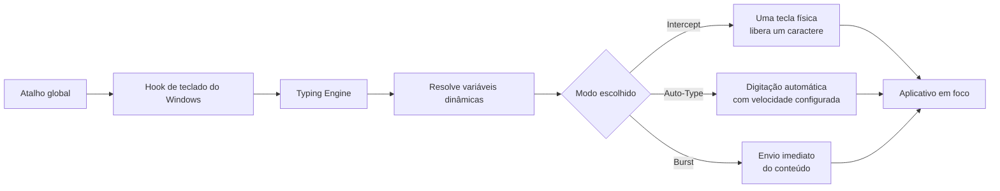
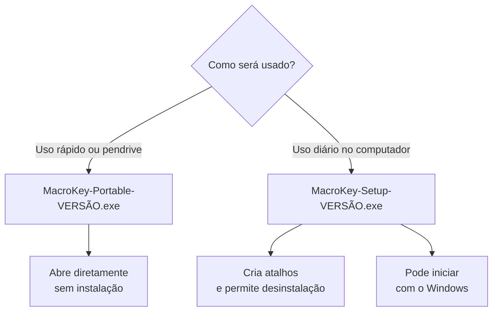

<div align="center">
  

  # MacroKey

  **Macros globais de texto para qualquer aplicativo do Windows.**

  [](https://github.com/Eduardo00073/MarkKey/actions/workflows/ci.yml)
  
  
  
  
  [](LICENSE)

  [](https://www.prof-eduardo.com/)
  [](https://www.linkedin.com/in/edu7/)
  [](https://github.com/Eduardo00073)

  [Interface](#interface) · [Visão geral](#visão-geral) · [Como funciona](#como-funciona) · [Instalação](#instalação-e-distribuição) · [Desenvolvimento](#desenvolvimento) · [Arquitetura](docs/ARCHITECTURE.md) · [Licença](#licença) · [Autor](#autor) · [Segurança](SECURITY.md)
</div>

> [!NOTE]
> Este é um projeto público e **source available**, licenciado para estudo e demais usos não comerciais. Uso por empresas, monetização ou qualquer aplicação com finalidade comercial exige autorização prévia do autor.

## Interface

<p align="center">
  
</p>

<p align="center">
  <sub>Biblioteca e editor de macros no tema escuro.</sub>
</p>

## Visão geral

O MacroKey é um aplicativo desktop que associa atalhos globais a blocos de texto. Quando um atalho é acionado, o conteúdo da macro é processado e enviado para o aplicativo que estiver em foco — navegador, editor, sistema de atendimento ou qualquer outro campo de texto do Windows.

| | Recurso | O que entrega |
| --- | --- | --- |
| ⌨️ | **Atalhos globais** | Teclas simples ou combinações com `Ctrl`, `Shift`, `Alt` e `Meta`. |
| ⚡ | **Três modos de execução** | Intercept, Auto-Type e Burst para comportamentos diferentes. |
| 🧩 | **Variáveis dinâmicas** | Data, hora, clipboard, usuário, UUID, contador e outros valores em tempo real. |
| 🎛️ | **Preferências persistentes** | Tema claro/escuro, HUD opcional e inicialização com o Windows. |
| 🗂️ | **Biblioteca organizada** | Categorias, favoritos, cartões de macro e contador de uso. |
| 💾 | **Dados locais** | Macros armazenadas no computador, com importação e exportação `.macrokey`. |

## Como funciona



1. O engine registra os atalhos das macros salvas.
2. O hook nativo identifica o atalho mesmo quando o MacroKey está na bandeja.
3. As variáveis são resolvidas somente no momento da execução.
4. O texto é enviado conforme o modo escolhido.
5. `Escape` cancela uma macro em andamento.

### Modos de execução

| Modo | Quando usar | Comportamento |
| --- | --- | --- |
| **Intercept** | Quando cada ação física deve avançar a macro. | Cada tecla pressionada envia o próximo caractere e bloqueia a tecla original. |
| **Auto-Type** | Para textos longos com ritmo configurável. | Digita automaticamente usando os atrasos mínimo e máximo definidos. |
| **Burst** | Para inserções curtas e imediatas. | Envia todo o conteúdo sem aguardar novas teclas. |

### Preferências

| Preferência | Padrão | Observação |
| --- | --- | --- |
| Tema | Claro | Pode ser alternado para escuro pela barra superior ou em **Preferências**. |
| Mostrar HUD | Desligado | Quando ativo, exibe macro, progresso e lembrete de cancelamento. |
| Iniciar com o Windows | Ligado no instalador | Abre silenciosamente na bandeja após entrar no Windows. |

> [!NOTE]
> A inicialização automática não é oferecida na versão portátil, porque ela é extraída para um diretório temporário diferente a cada execução.

## Variáveis dinâmicas

As variáveis usam a sintaxe `{{nome}}` e são substituídas apenas quando a macro é executada.

| Categoria | Variável | Resultado |
| --- | --- | --- |
| Data e hora | `{{data}}` | Data atual em `DD/MM/AAAA`. |
| Data e hora | `{{data:ISO}}` | Data atual em `AAAA-MM-DD`. |
| Data e hora | `{{data:US}}` | Data atual em `MM/DD/AAAA`. |
| Data e hora | `{{hora}}` | Horário atual com segundos. |
| Data e hora | `{{hora:curta}}` | Horário atual sem segundos. |
| Data e hora | `{{timestamp}}` | Timestamp Unix atual em milissegundos. |
| Sistema | `{{clipboard}}` | Texto atual da área de transferência. |
| Sistema | `{{usuario}}` | Nome do usuário do Windows. |
| Sistema | `{{hostname}}` | Nome do computador. |
| Geração | `{{random:6}}` | Número aleatório com a quantidade indicada de dígitos. |
| Geração | `{{uuid}}` | UUID v4. |
| Contexto | `{{contador}}` | Número da próxima execução da macro. |
| Formatação | `{{quebra}}` | Quebra de linha. |
| Formatação | `{{tab}}` | Tabulação. |
| Texto | `{{saudacao}}` | “Bom dia”, “Boa tarde” ou “Boa noite”, conforme o horário. |

Exemplo:

```text
{{saudacao}}, {{usuario}}!

Atendimento registrado em {{data}} às {{hora:curta}}.
Protocolo: {{uuid}}
```

## Instalação e distribuição

O computador de destino não precisa ter Node.js, npm ou o código-fonte.



| Formato | Arquivo | Características |
| --- | --- | --- |
| **Portátil** | `MacroKey-Portable-1.0.0.exe` | Arquivo único, executado com duplo clique e sem instalação. |
| **Instalador** | `MacroKey-Setup-1.0.0.exe` | Escolha de pasta, atalhos, desinstalação e startup configurável. |

Os artefatos locais ficam em `dist/` e não são versionados no Git.

> [!WARNING]
> Os executáveis ainda não possuem assinatura digital. Em outro computador, o Windows SmartScreen pode exibir um aviso. Uma distribuição pública profissional exige certificado de assinatura de código.

## Desenvolvimento

### Requisitos

- Windows 10 ou 11, x64;
- Node.js 22.12 ou mais recente;
- npm 10 ou mais recente.

### Primeira execução

```powershell
git clone https://github.com/Eduardo00073/MarkKey.git
cd MarkKey
npm install
npm run dev
```

Ao fechar a janela, o MacroKey continua executando na bandeja. Use **Sair** no menu da bandeja para encerrar o processo.

### Comandos

| Comando | Finalidade | Saída |
| --- | --- | --- |
| `npm run dev` | Inicia Electron e Vite em desenvolvimento. | Aplicativo aberto com recarga rápida. |
| `npm run typecheck` | Valida os três contextos TypeScript. | Sem artefatos. |
| `npm run check` | Valida tipos, código morto, ciclos e vulnerabilidades. | Relatório no terminal. |
| `npm run build` | Compila os processos principal, preload e renderer. | `out/` |
| `npm run package:portable` | Gera somente o executável portátil x64. | `dist/MacroKey-Portable-*.exe` |
| `npm run package:installer` | Gera somente o instalador NSIS x64. | `dist/MacroKey-Setup-*.exe` |
| `npm run package` | Gera os dois formatos de distribuição. | `dist/` |

## Arquitetura

O projeto separa a interface das APIs nativas do sistema operacional:

```text
src/
├── main/       Electron, engine, hook, persistência, IPC, bandeja e HUD
├── preload/    API mínima exposta ao renderer pelo contextBridge
├── renderer/   Interface React, Monaco Editor, componentes e temas
└── shared/     Tipos e nomes de canais compartilhados
```

Consulte [docs/ARCHITECTURE.md](docs/ARCHITECTURE.md) para os diagramas de processos, fluxos de dados, limites de segurança e responsabilidades de cada módulo.

## Dados e segurança

- As macros e preferências são armazenadas localmente pelo `electron-store`.
- O projeto não implementa telemetria nem envio das macros para um servidor.
- O renderer usa `contextIsolation: true` e `nodeIntegration: false`.
- O preload expõe somente operações tipadas e previamente definidas.
- O hook ignora os eventos injetados pelo próprio MacroKey para evitar loops.
- A integração contínua executa tipagem, análise de código morto, detecção de ciclos, auditoria de dependências e build.

Para relatar uma vulnerabilidade, siga obrigatoriamente a [Política de Segurança](SECURITY.md). Não publique detalhes sensíveis em issues.

## Contribuição

Antes de alterar o projeto, leia:

- [CONTRIBUTING.md](CONTRIBUTING.md) — ambiente, branches, padrões e checklist de pull request;
- [docs/ARCHITECTURE.md](docs/ARCHITECTURE.md) — responsabilidades e fronteiras entre os processos;
- [SECURITY.md](SECURITY.md) — escopo e divulgação responsável de vulnerabilidades.

## Licença

O MacroKey é disponibilizado sob a [PolyForm Noncommercial License 1.0.0](LICENSE), identificada no SPDX como `PolyForm-Noncommercial-1.0.0`.

| Finalidade | Condição |
| --- | --- |
| Estudo, pesquisa, ensino, experimentação e projetos de hobby | **Permitido**, sem cobrança. |
| Uso pessoal sem finalidade comercial | **Permitido**, preservando a atribuição ao autor. |
| Modificação ou redistribuição não comercial | **Permitido**, desde que `LICENSE` e `NOTICE` acompanhem a cópia. |
| Uso empresarial, profissional, monetizado ou com geração direta ou indireta de receita | **Não coberto pela licença pública**; exige autorização escrita e licença comercial separada. |

As atribuições obrigatórias e o contato comercial estão no arquivo [NOTICE](NOTICE). Para solicitar uso comercial, entre em contato pelo [site oficial](https://www.prof-eduardo.com/).

> [!IMPORTANT]
> A restrição a usos comerciais significa que esta não é uma licença open source aprovada pela OSI. O termo correto para o projeto é **source available**.

## Autor

Desenvolvido por **Eduardo Junior Alcântara da Silva**, desenvolvedor Full Stack e professor de Programação, Informática e Robótica, com atuação em desenvolvimento web e desktop, cibersegurança, inteligência artificial e educação tecnológica.

- 🌐 [Site oficial — prof-eduardo.com](https://www.prof-eduardo.com/)
- 💼 [LinkedIn — Eduardo Alcântara](https://www.linkedin.com/in/edu7/)
- 💻 [GitHub — @Eduardo00073](https://github.com/Eduardo00073)

---

<div align="center">
  Copyright © 2026 Eduardo Junior Alcântara da Silva.<br />
  Todos os direitos reservados.
</div>
