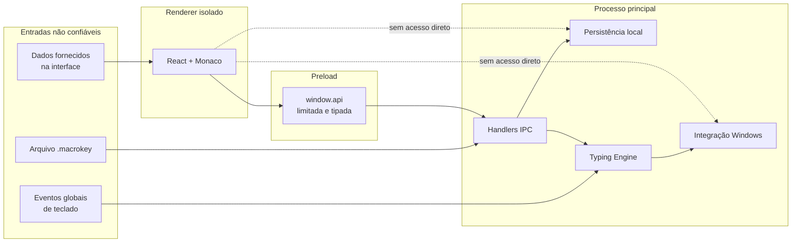
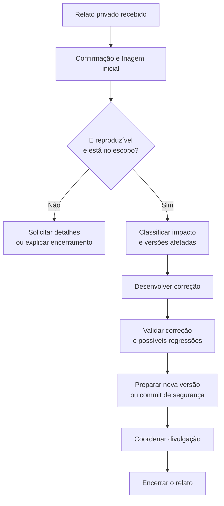

# Política de Segurança do MacroKey

A segurança do MacroKey depende principalmente de três fronteiras: o hook global de teclado, a ponte IPC entre os processos do Electron e os arquivos `.macrokey` importados. Este documento explica o que deve ser relatado, como enviar um relato com segurança e o que acontece depois.

> [!CAUTION]
> **Não publique uma vulnerabilidade em uma issue, discussão, pull request ou commit.** Um relato público pode permitir exploração antes que exista uma correção.

## Navegação rápida

- [Resumo para quem encontrou um problema](#resumo-para-quem-encontrou-um-problema)
- [Versões suportadas](#versões-suportadas)
- [Modelo de segurança](#modelo-de-segurança)
- [Escopo](#escopo)
- [Como relatar](#como-relatar)
- [Processo de resposta](#processo-de-resposta)
- [Divulgação coordenada](#divulgação-coordenada)
- [Para mantenedores](#para-mantenedores)

## Resumo para quem encontrou um problema

| Pergunta | Resposta |
| --- | --- |
| Onde relatar? | Pelo **Private vulnerability reporting** do GitHub, quando disponível, ou por um canal privado combinado com o proprietário. |
| O que enviar? | Impacto, versão afetada, reprodução mínima, evidências e possíveis mitigações. |
| O que não enviar? | Tokens, senhas, macros pessoais, dumps completos ou dados de terceiros. |
| Quando divulgar? | Somente depois de uma correção ou com autorização expressa do proprietário. |
| Issues públicas são aceitas? | Não para vulnerabilidades ou suspeitas com detalhes exploráveis. |

## Versões suportadas

O projeto ainda está na série inicial `1.x`. A política de manutenção é:

| Versão | Suporte de segurança |
| --- | --- |
| Última versão disponível na branch `main` | ✅ Suportada |
| Executável mais recente gerado a partir de `main` | ✅ Suportado |
| Builds ou commits anteriores | ⚠️ Avaliados caso a caso |
| Forks, binários modificados ou distribuições de terceiros | ❌ Fora do escopo |

Se possível, reproduza o problema no commit mais recente antes de enviar o relato.

## Modelo de segurança



Controles existentes:

- `contextIsolation: true` nas janelas;
- `nodeIntegration: false` no renderer;
- API explícita pelo `contextBridge`;
- canais IPC centralizados e tipados;
- validação e normalização na importação `.macrokey`;
- eventos de teclado injetados pelo próprio aplicativo são ignorados pelo hook;
- macros e preferências ficam no armazenamento local;
- o HUD é click-through e não recebe foco;
- auditoria de dependências e análise estática na CI.

### Limitações conhecidas de hardening

Estas limitações não são, isoladamente, uma prova de vulnerabilidade, mas devem ser consideradas em mudanças futuras:

| Área | Estado atual | Direção recomendada |
| --- | --- | --- |
| Sandbox do Electron | As janelas declaram `sandbox: false`. | Avaliar ativação após testar preload, Monaco e integração do HUD. |
| Assinatura de código | Os executáveis não possuem certificado. | Assinar artefatos destinados a distribuição ampla. |
| Armazenamento local | O `electron-store` não criptografa o conteúdo das macros. | Não tratar o store como cofre de segredos; avaliar proteção adicional se o produto passar a armazená-los. |
| Tamanho de importação | O arquivo é lido integralmente antes do parse. | Definir limite de tamanho antes de aceitar fontes não confiáveis em escala. |
| Política de conteúdo | Não há CSP explícita no HTML atual. | Adicionar e validar uma política compatível com Vite e Monaco. |

> [!NOTE]
> O hook global observa eventos necessários para identificar atalhos e executar macros. O código atual não implementa telemetria nem transmissão das teclas ou das macros para um servidor.

## Escopo

### Vulnerabilidades relevantes

Relate problemas que possam causar:

- execução arbitrária de código ou comandos;
- quebra do isolamento entre renderer, preload e processo principal;
- acesso indevido a arquivos, clipboard, macros ou preferências;
- chamadas IPC não autorizadas ou com validação insuficiente;
- persistência indevida ou insegura na inicialização do Windows;
- abuso do hook global para capturar, alterar ou bloquear entradas além do necessário;
- recursão, travamento ou comportamento inesperado causado por eventos injetados;
- importação de arquivo `.macrokey` malicioso, corrompido ou excessivamente grande;
- path traversal, sobrescrita de arquivo ou exposição de caminho na importação/exportação;
- bypass do cancelamento com `Escape` ou supressão indevida de teclas;
- vulnerabilidade em dependência com impacto comprovável no MacroKey;
- exposição de segredos nos binários, logs, commits ou automações.

### Fora do escopo

Normalmente não são tratados como vulnerabilidade:

- aviso do Windows SmartScreen causado pela ausência de assinatura digital;
- detecção genérica de antivírus sem evidência técnica reproduzível;
- acesso às macros por uma pessoa que já controla a sessão do Windows e os arquivos do usuário;
- engenharia social, phishing ou acesso físico ao computador desbloqueado;
- comportamento de forks ou executáveis alterados por terceiros;
- indisponibilidade causada por hardware ou versões não suportadas do Windows;
- sugestões de hardening sem caminho de exploração demonstrável;
- problemas puramente visuais, de usabilidade ou desempenho sem impacto de segurança.

Se houver dúvida, envie o relato de forma privada. O enquadramento será feito durante a triagem.

## Como relatar

### Canal preferencial

1. Abra a página **Security** do repositório.
2. Use **Report a vulnerability**, se a funcionalidade estiver disponível.
3. Se não estiver, contate o proprietário por um canal privado previamente combinado.

Não há um endereço público dedicado listado neste repositório. Isso evita transformar um canal não monitorado em uma falsa garantia de resposta.

### Informações necessárias

Use este modelo:

```text
Título: resumo objetivo da vulnerabilidade

Versão/commit afetado:
Ambiente: versão do Windows e arquitetura
Componente: main, preload, renderer, hook, importação, instalador etc.

Resumo:
Impacto:
Pré-condições:
Passos para reprodução:
Resultado observado:
Resultado esperado:

Evidências sanitizadas:
Mitigação ou correção sugerida:
Disponibilidade para contato:
```

Uma reprodução segura e mínima é mais útil que um dump completo do ambiente.

### Tratamento de dados no relato

- Substitua nomes, e-mails e caminhos pessoais por valores fictícios.
- Remova o conteúdo real de macros e do clipboard.
- Nunca envie tokens do GitHub, chaves de API, senhas ou cookies.
- Prefira arquivos de demonstração criados especificamente para a reprodução.
- Avise antes de enviar anexos grandes ou executáveis.

## Processo de resposta



O objetivo é:

1. confirmar o recebimento assim que o canal privado for verificado;
2. reproduzir e classificar o problema;
3. manter o relator informado quando houver avanço relevante;
4. preparar e validar uma correção proporcional ao risco;
5. combinar a divulgação antes de qualquer publicação técnica.

Os prazos dependem da complexidade e do impacto. Esta política não promete um SLA fixo, mas relatos críticos recebem prioridade sobre trabalho comum de produto.

## Severidade orientativa

| Severidade | Exemplos |
| --- | --- |
| **Crítica** | Execução de código sem interação adicional; comprometimento amplo da sessão. |
| **Alta** | Escape do renderer; leitura ou alteração relevante de dados por entrada não confiável. |
| **Média** | Bloqueio persistente do teclado; importação capaz de causar negação de serviço reproduzível. |
| **Baixa** | Exposição limitada, hardening ou falha que exige condições improváveis e alto acesso prévio. |

A classificação final considera impacto, explorabilidade, privilégios exigidos, interação do usuário e alcance.

## Divulgação coordenada

Até a correção estar disponível:

- mantenha os detalhes técnicos no canal privado;
- não publique proof of concept funcional;
- não teste em sistemas ou dados de terceiros;
- não abra um pull request público que revele o vetor;
- não atribua um identificador ou severidade pública sem coordenação.

Depois da correção, os créditos ao relator podem ser incluídos se ele desejar e se a divulgação não criar risco adicional.

## Para mantenedores

Checklist mínimo de resposta:

- [ ] Preservar o relato e as evidências em canal privado.
- [ ] Confirmar commit, versão e ambiente afetados.
- [ ] Reproduzir com dados sintéticos.
- [ ] Mapear o limite de confiança violado.
- [ ] Verificar variantes do mesmo problema.
- [ ] Criar correção sem incluir o exploit na mensagem do commit antes da divulgação.
- [ ] Executar `npm run check` e `npm run build`.
- [ ] Testar o cenário no Windows e nos artefatos empacotados, quando aplicável.
- [ ] Revisar documentação, dependências e configurações relacionadas.
- [ ] Coordenar versão, comunicação e crédito.

## Documentos relacionados

- [README.md](README.md) — visão geral e comportamento do produto;
- [docs/ARCHITECTURE.md](docs/ARCHITECTURE.md) — processos, dados e limites de confiança;
- [CONTRIBUTING.md](CONTRIBUTING.md) — padrões para mudanças seguras.
