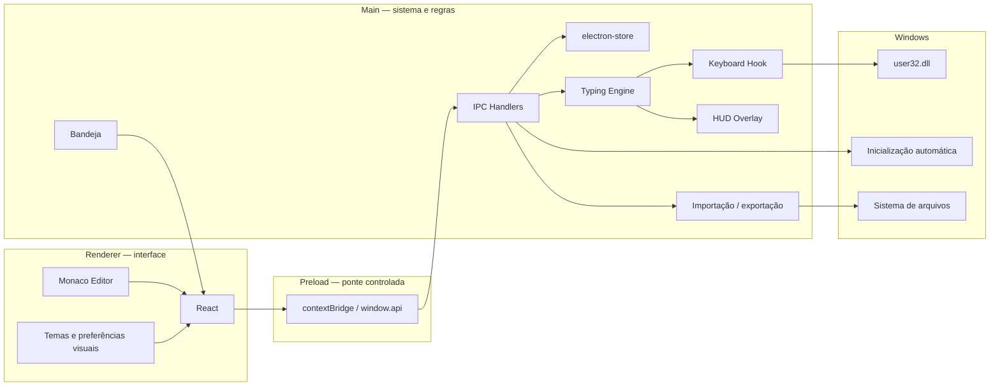
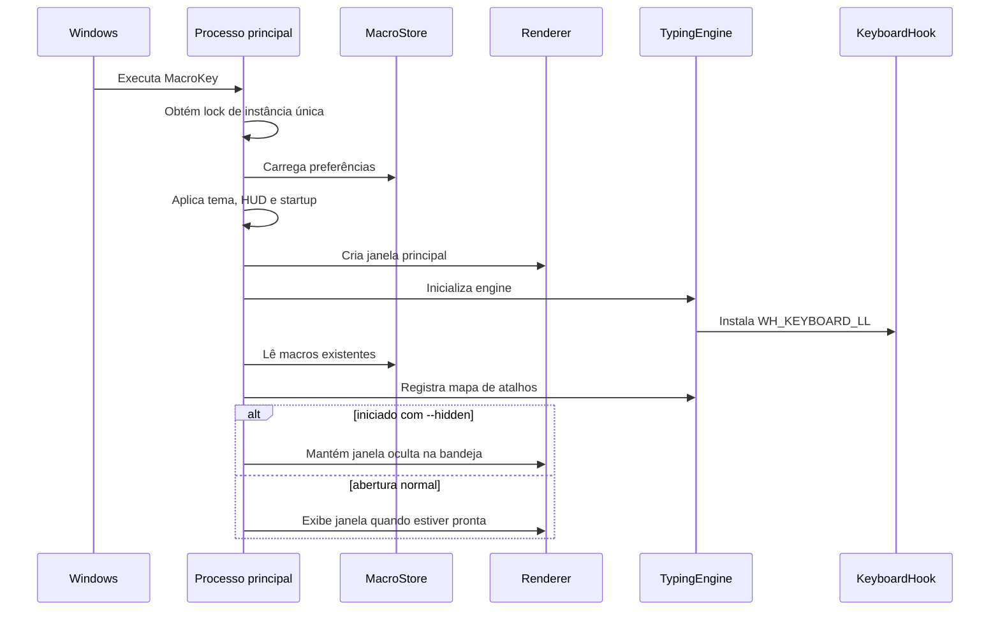
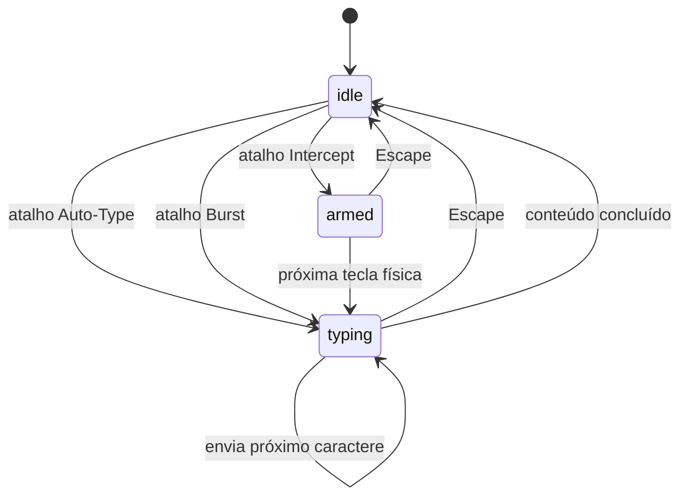
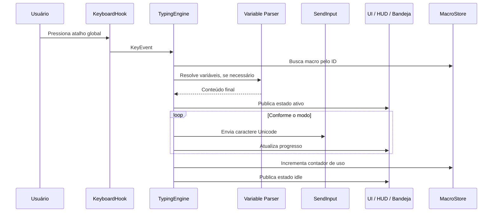
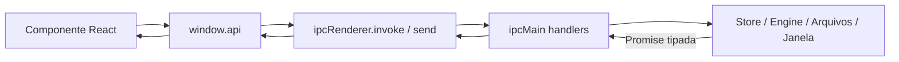
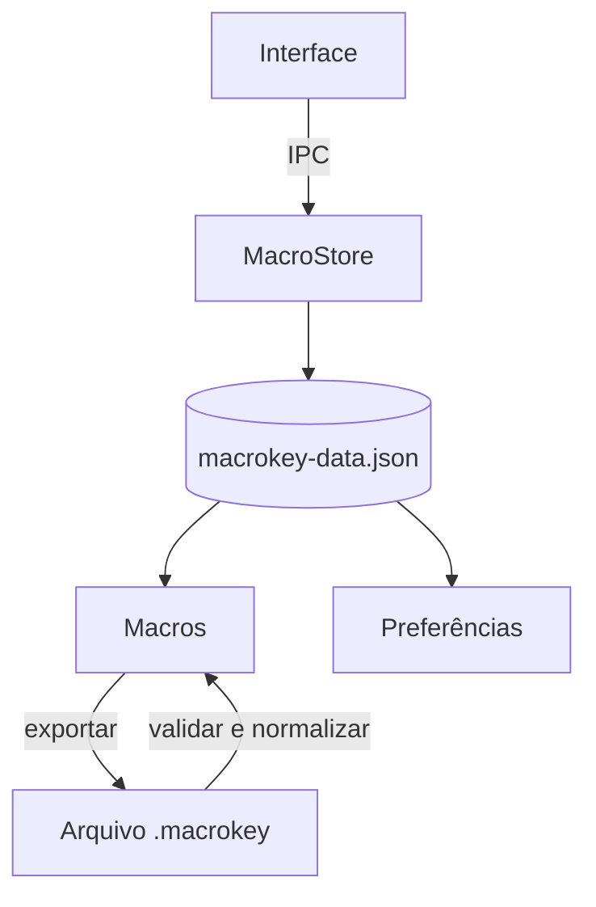
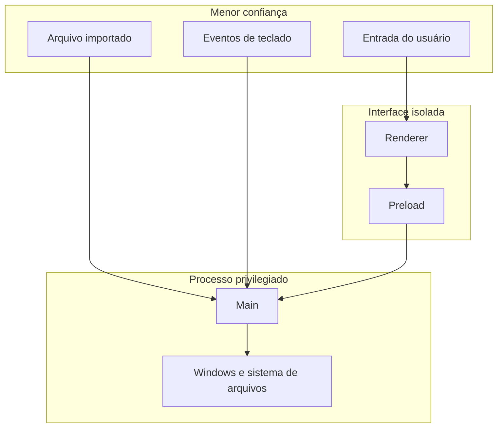
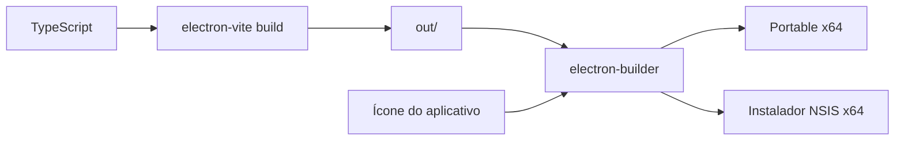
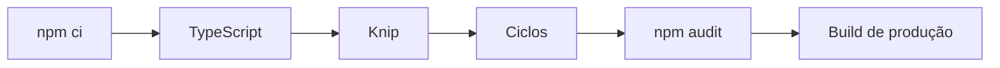

# Arquitetura do MacroKey

Este documento explica como o MacroKey é organizado, como os processos se comunicam e onde ficam as principais fronteiras de segurança. Ele serve como mapa para manutenção, revisão de código e evolução do produto.

## Navegação rápida

- [Visão geral](#visão-geral)
- [Processos e responsabilidades](#processos-e-responsabilidades)
- [Inicialização do aplicativo](#inicialização-do-aplicativo)
- [Execução de uma macro](#execução-de-uma-macro)
- [Comunicação IPC](#comunicação-ipc)
- [Persistência](#persistência)
- [Preferências e capacidades](#preferências-e-capacidades)
- [Limites de confiança](#limites-de-confiança)
- [Build e distribuição](#build-e-distribuição)

## Visão geral

O MacroKey é um aplicativo Electron dividido em três contextos de execução e uma camada de contratos compartilhados.



## Processos e responsabilidades

| Contexto | Entrada principal | Responsabilidades | Privilégios |
| --- | --- | --- | --- |
| **Main** | `src/main/index.ts` | Ciclo de vida, janelas, engine, hook, store, arquivos, bandeja e integração com Windows. | Node.js, Electron e APIs nativas. |
| **Preload** | `src/preload/index.ts` | Traduzir operações permitidas em uma API pequena para a interface. | IPC controlado e `contextBridge`. |
| **Renderer** | `src/renderer/index.tsx` | Interface React, edição, estado visual, temas e interação do usuário. | DOM e `window.api`; sem Node.js direto. |
| **Shared** | `src/shared/types.ts` | Tipos, contratos e nomes de canais usados entre processos. | Nenhum runtime próprio. |

## Mapa dos módulos

```text
src/
├── main/
│   ├── index.ts             Ciclo de vida e composição do aplicativo
│   ├── ipc-handlers.ts      Operações chamadas pelo renderer
│   ├── store.ts             Macros e preferências persistentes
│   ├── keyboard-hook.ts     Hook global e SendInput via user32.dll
│   ├── typing-engine.ts     Estados e execução das macros
│   ├── variable-parser.ts   Resolução de tokens dinâmicos
│   ├── import-export.ts     Formato .macrokey e diálogos de arquivo
│   ├── hud-overlay.ts       Janela flutuante de progresso
│   └── tray.ts              Ícone e menu da bandeja
├── preload/
│   └── index.ts             window.api
├── renderer/
│   ├── App.tsx              Estado e composição principal
│   ├── components/          Componentes da interface
│   ├── styles/              Design system e animações
│   └── assets/              Identidade visual
└── shared/
    └── types.ts             Contratos compartilhados
```

## Inicialização do aplicativo



O lock de instância única impede dois engines competindo pelo mesmo teclado. Uma segunda abertura apenas mostra e foca a janela existente.

## Execução de uma macro

O engine usa uma máquina de estados pequena:



### Sequência detalhada



Eventos produzidos pelo próprio `SendInput` possuem a flag `LLKHF_INJECTED` e são ignorados pelo hook. Sem essa verificação, os caracteres simulados poderiam retornar ao engine e criar recursão.

## Modos do engine

| Modo | Estado inicial | Supressão de tecla | Ritmo |
| --- | --- | --- | --- |
| Intercept | `armed` | Sim, exceto modificadores e `Escape`. | Um caractere por tecla física. |
| Auto-Type | `typing` | Não. | Atrasos mínimo/máximo e humanização opcional. |
| Burst | `typing` transitório | Não. | Envio imediato de todas as unidades UTF-16. |

## Comunicação IPC

O renderer nunca importa módulos nativos. Toda operação privilegiada passa pela API do preload.



### Grupos de operações

| Grupo | Operações |
| --- | --- |
| Macros | listar, criar, atualizar, excluir, importar e exportar. |
| Preferências | obter configurações, atualizar configurações e consultar capacidades do build. |
| Eventos | mudança de macro e status do engine. |
| Janela | minimizar, maximizar e fechar para a bandeja. |

Ao adicionar uma operação:

1. declare o canal em `src/shared/types.ts`;
2. implemente e valide o handler em `src/main/ipc-handlers.ts`;
3. exponha uma função específica em `src/preload/index.ts`;
4. consuma somente essa função no renderer.

## Persistência



### Dados persistidos

| Grupo | Conteúdo |
| --- | --- |
| Macros | Nome, conteúdo, hotkey, categoria, modo, favorito, velocidade, humanização e contador. |
| Preferências | Tema, exibição do HUD e inicialização com o Windows. |

Os arquivos exportados não preservam `id` nem `usageCount`. Esses campos pertencem ao runtime e são recriados na importação.

## Formato `.macrokey`

O formato é JSON versionado:

```json
{
  "version": 1,
  "exportedAt": "2026-08-25T12:00:00.000Z",
  "appVersion": "1.0.0",
  "macros": []
}
```

Na importação:

1. o JSON precisa ser válido;
2. `version` e `macros` precisam existir no formato esperado;
3. versões futuras são rejeitadas;
4. cada macro é normalizada com tipos, valores padrão e limites de velocidade;
5. IDs e contadores são gerados localmente.

## Preferências e capacidades

Nem toda configuração é válida em todo tipo de build. O processo principal fornece `AppCapabilities` para que a interface não prometa algo impossível.

| Capacidade | Instalada | Portátil | Desenvolvimento |
| --- | --- | --- | --- |
| Tema | ✅ | ✅ | ✅ |
| HUD | ✅ | ✅ | ✅ |
| Iniciar com o Windows | ✅ | ❌ | ❌ |

A versão portátil define `PORTABLE_EXECUTABLE_FILE` durante a execução e é extraída para uma pasta temporária. Registrar `process.execPath` nesse cenário criaria uma entrada de startup inválida; por isso a capacidade é bloqueada.

## Limites de confiança



Princípios:

- validar sempre ao atravessar uma fronteira;
- não confiar em tipos TypeScript como validação de runtime;
- manter a API do preload pequena;
- evitar APIs genéricas de arquivo ou execução de comando;
- tratar importações como conteúdo não confiável;
- evitar que o renderer controle caminhos, processos ou módulos arbitrários.

Consulte [SECURITY.md](../SECURITY.md) para o processo de relato e o escopo de vulnerabilidades.

## Build e distribuição



O `electron-builder` inclui apenas `out/**/*` como código do aplicativo. Os artefatos de distribuição ficam em `dist/` e são ignorados pelo Git.

## Qualidade e integração contínua

Em cada push ou pull request para `main`, a CI executa:



O build da CI garante portabilidade do código TypeScript, mas recursos nativos do Windows — hook, bandeja, startup e instalador — também precisam de teste manual no Windows.

## Como evoluir a arquitetura

Uma mudança arquitetural deve responder:

1. Qual processo deve possuir essa responsabilidade?
2. A mudança amplia a API privilegiada exposta ao renderer?
3. Existe entrada não confiável que precisa de validação de runtime?
4. Recursos precisam ser liberados no encerramento?
5. A funcionalidade se comporta de forma diferente no portátil?
6. O fluxo precisa ser documentado ou representado em um novo contrato compartilhado?

O guia completo para branches, validação e pull requests está em [CONTRIBUTING.md](../CONTRIBUTING.md).
